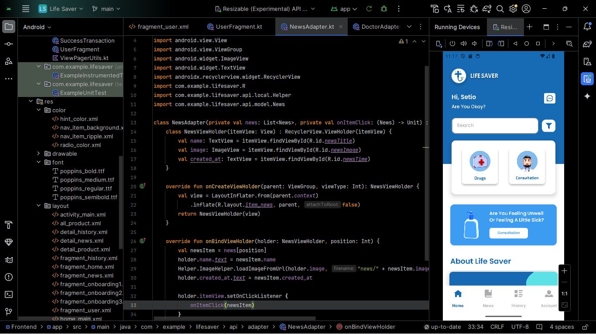

# 📱 Life Saver - Aplikasi Layanan Kesehatan Digital Modern

---

## 🩺 Deskripsi

**Life Saver** adalah sebuah aplikasi mobile yang dirancang untuk memberikan kemudahan akses layanan kesehatan secara digital bagi masyarakat luas.  
Aplikasi ini mengintegrasikan berbagai kebutuhan kesehatan dalam satu platform, mulai dari informasi seputar obat-obatan, berita dan edukasi kesehatan terkini, hingga layanan konsultasi dokter secara **gratis**.  

Dengan memanfaatkan teknologi modern, **Life Saver** bertujuan untuk membantu masyarakat mendapatkan akses layanan kesehatan yang lebih mudah, efisien, dan praktis tanpa harus selalu datang ke fasilitas kesehatan secara langsung.

Life Saver dikembangkan sebagai solusi bagi masyarakat modern yang membutuhkan layanan kesehatan cepat, mudah, dan terpercaya dalam satu aplikasi yang simpel digunakan.

---

## 🚀 Teknologi yang Digunakan
Aplikasi ini dibangun menggunakan **stack teknologi modern** untuk memastikan performa yang optimal dan pengembangan yang mudah di-maintain ke depannya.

| Teknologi  | Deskripsi Singkat |
|------------|-------------------|
|  **Kotlin** | Bahasa pemrograman utama untuk pengembangan aplikasi Android, modern, aman, dan ringan. |
|  **NestJS** | Framework backend berbasis Node.js yang memanfaatkan TypeScript, memberikan arsitektur yang clean dan maintainable. |
|  **TypeScript** | Bahasa pemrograman modern yang memberikan keamanan typing lebih kuat untuk pengembangan backend. |
|  **MySQL** | Database relasional yang digunakan untuk menyimpan data seperti user, transaksi pembelian obat, riwayat konsultasi, dan konten edukasi kesehatan. |

---

## ✨ Fitur Utama

### 💊 1. Penjualan Obat-obatan
Life Saver menyediakan fitur penjualan berbagai produk obat-obatan secara online.  
Pengguna dapat dengan mudah mencari, memilih, dan melakukan pembelian langsung melalui aplikasi.  
Data produk tersimpan aman di database MySQL dengan proses transaksi yang simpel dan aman.

---

### 📰 2. Berita & Edukasi Kesehatan
Tidak hanya fokus pada penjualan, Life Saver juga memberikan konten edukasi berupa artikel, berita, dan tips kesehatan yang bermanfaat.  
Konten ini disusun dengan tujuan untuk memberikan pemahaman yang lebih baik kepada masyarakat mengenai pentingnya menjaga kesehatan tubuh, pola hidup sehat, dan pencegahan penyakit.

---

### 🩺 3. Konsultasi Dokter Gratis
Fitur konsultasi dokter memungkinkan pengguna berkonsultasi secara langsung dengan tenaga medis profesional tanpa dipungut biaya apapun.  
Fitur ini memberikan kemudahan bagi mereka yang memiliki keterbatasan akses ke fasilitas kesehatan, khususnya untuk keluhan ringan atau konsultasi awal.  
Semua percakapan bersifat pribadi dan dijamin keamanannya.

---

## 🎯 **Kenapa Life Saver?**
- Membantu masyarakat mendapatkan **akses layanan kesehatan yang lebih cepat, praktis, dan hemat biaya.**
- Memadukan **edukasi, layanan, dan transaksi** dalam satu aplikasi yang user-friendly.
- Dikembangkan menggunakan teknologi yang **modern, aman, dan scalable**.

---

## 📝 **Penutup**
Life Saver dikembangkan dengan semangat memberikan dampak sosial yang positif, memudahkan akses kesehatan terutama di era modern ini yang serba digital.  
Aplikasi ini cocok digunakan oleh semua kalangan, mulai dari anak muda, orang tua, hingga masyarakat umum yang ingin lebih peduli dengan kesehatannya.

---

